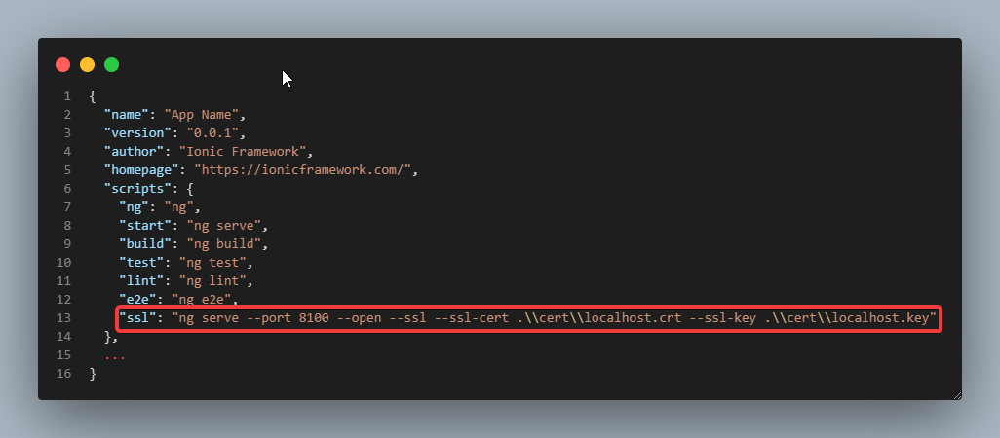
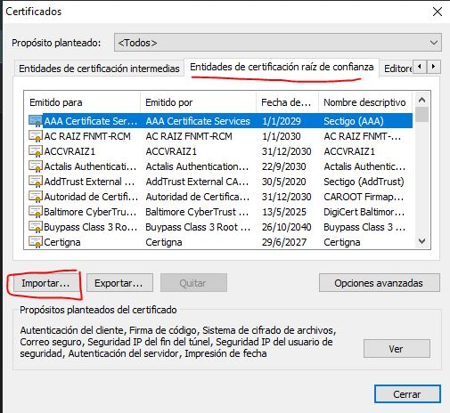
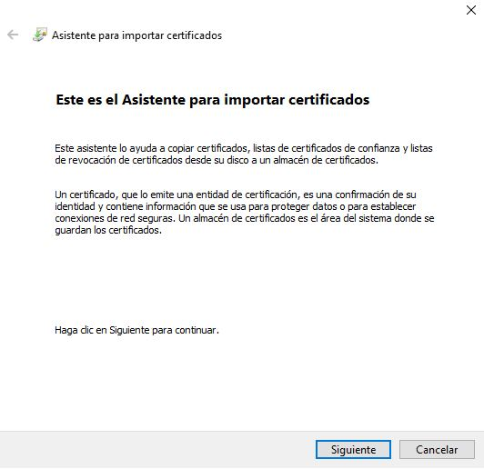
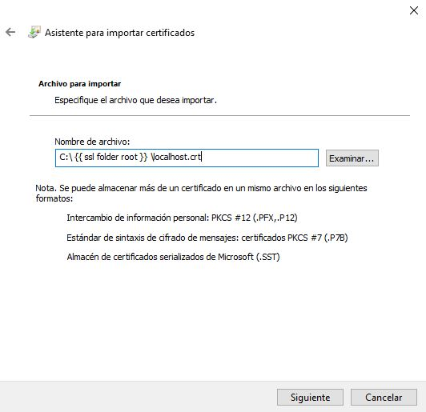
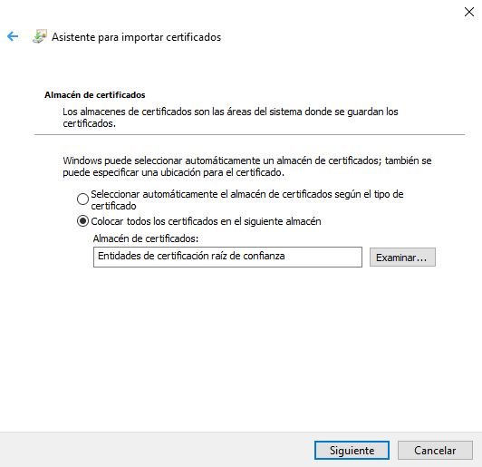
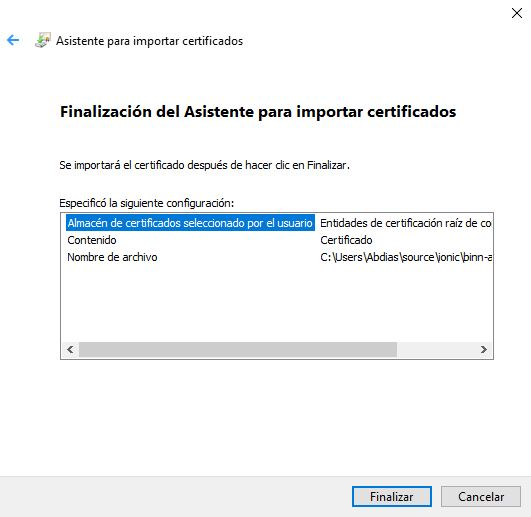
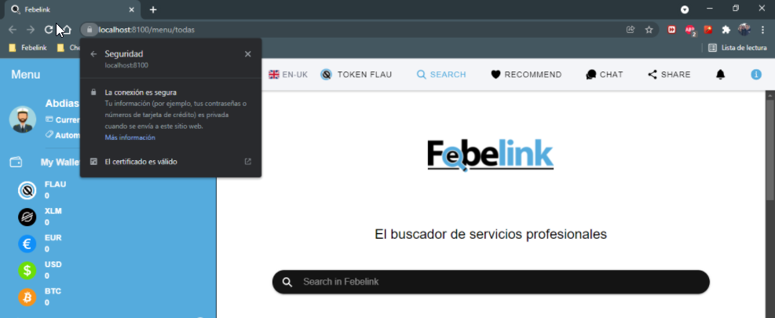

## **`Initial Date`**
 Nov-10, 2021
<br>

### **`Autor`**

     Abdías Natanael Vrech
     Tel. +34 681 93 54 92
     Ontinyent, Valencia, SP
     email: abdias.dev@gmail.com
___

# Install `SSL Certificate` in `localhost`

## Create Certificate

### ( if allready have one &ensp;{&ensp; `localhost.crt` &ensp;} &ensp; go to &ensp; [`Install Certificate`](#install-certificate) &emsp; section )
<br>

* [ Install OpenSSL](https://www.youtube.com/watch?v=eLb0w1uGxUE)
    <br>( &emsp; _if you have `git` installed, you probably allready have `openssl` in this folder :point_right: `C:\Program Files\Git\usr\bin\openssl.exe`_ &emsp; )
<br><br>

* Create file with the next content in, named :point_right: `certificate.cnf`

    ```
    [req]
    default_bits = 2048
    prompt = no
    default_md = sha256
    x509_extensions = v3_req
    distinguished_name = req_distinguished_name

    [req_distinguished_name]
    C = SP
    ST = Spain
    L = Spain
    O = My Organization
    OU = My Organisational Unit
    emailAddress = email@domain.com
    CN = localhost

    [v3_req]
    subjectAltName = @alt_names
    keyUsage=digitalSignature
    extendedKeyUsage=serverAuth

    [alt_names]
    DNS = localhost
    DNS.1 = *.localhost
    DNS.2 = *.localhost:8100
    ```
<br>
    
* Open `cmd` &emsp; ( _or `git bash` if using it_ ) &emsp; in `certificate.cnf` folder and run this command

    _( it creates 2 files: `localhost.key`&emsp;&&&emsp;`localhost.crt` based on params inside &emsp;`certificate.cnf` )_
    
    ```
    openssl req -new -x509 -newkey rsa:2048 -sha256 -nodes -keyout localhost.key -days 3560 -out localhost.crt -config certificate.cnf
    ```
<br>

## Install Certificate

* Double click new file `localhost.crt` to install it
    
    1. Install Certificate
    2. Choose User or Local Device, click next
    3. Select Folder to save it:
        * Trusted Root Certification Authorities
        * Entidades de Certificacion Raiz de Confianza
    4. Save it
<br><br>
    
* Serve with certificates in the port that you wish with the certificates created _( in my case **8100** )_
    ```
    ng serve --port 8100 --open --ssl --ssl-cert .\\cert\\localhost.crt --ssl-key .\\cert\\localhost.key
    ```

* To shorten the previous command :point_up: you can add inside `package.json` a script with the previous line, and then run it in the console like this:
    ```
    npm run ssl
    ```
    
<br><br>


## Add Certificate to Browser

* Once web page opened, if it is yet not valid, add certificate to browser: _( this is in chrome web browser )_

    1. Go to Settings <br>
        

    2. Go to Security tab <br>
        

    3. Open Manage Certificates <br>
        

    4. Import Certificates into Trusted Entities <br>
        

        Follow the steps to install it <br>
            
        <br><br>
            
        <br><br>
            
        <br><br>
            
<br><br>


* On done, if still not showing the certificate validation, full restart the browser ( not just close on the **`X`** button, make sure there is no background app running ) _( check in the admin task.exe )_

<br>

___
___
<br>

## That's it, now you have the **`SSL Certificate`** on :point_right: `localhost` ... enjoy no more alerts in console !!
<br>



<br>